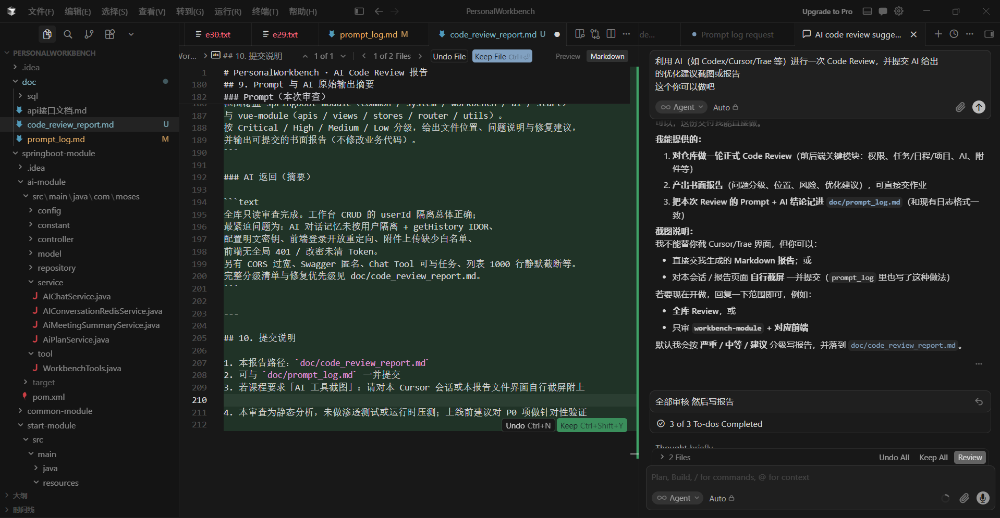

# PersonalWorkbench · AI Code Review 报告

| 项 | 内容 |
|---|---|
| 审查工具 | Cursor Agent（Composer） |
| 审查日期 | 2026-07-19 |
| 审查范围 | 全库：`springboot-module` + `vue-module` |
| 审查方式 | 只读静态审查（Controller / Service / Config / 前端 API·路由·页面） |
| 结论概览 | 工作台 CRUD 的 `userId` 隔离总体正确；存在 **AI 会话越权**、**配置明文密钥**、**登录开放重定向** 等需优先修复项 |

---

## 1. 执行摘要

本次对 PersonalWorkbench（Spring Boot 3.5 + Vue 3）进行全量 Code Review。整体架构清晰：Maven 多模块划分合理，工作台接口普遍带 `@SaCheckPermission` 且按登录用户过滤；前端动态路由与 `v-permission` 配套完整。

**主要风险集中在：**

1. AI 对话记忆 / 历史接口缺少用户归属校验（跨用户可读可写）
2. 数据库口令、JWT、验证码 HMAC 等密钥硬编码进仓库
3. 前端登录 `redirect` 未校验，存在开放重定向
4. 任务/会议附件上传缺少类型白名单；OSS 删除不彻底
5. 前端无全局 401 处理、改密后未清 Token

建议按本报告「优先级修复清单」分批整改；本报告仅给出审查结论与优化建议，**未改动业务代码**。

---

## 2. 问题统计

| 严重度 | 后端 | 前端 | 合计 |
|--------|------|------|------|
| Critical（严重） | 3 | 1 | **4** |
| High（高） | 8 | 6 | **14** |
| Medium（中） | 12 | 16 | **28** |
| Low / Suggestion | 12 | 12 | **24** |
| **合计** | **35** | **35** | **70** |

---

## 3. Critical — 必须优先修复

### C-1 · AI 对话 Redis 记忆未按用户隔离（跨用户泄漏 / 劫持）

| 项 | 内容 |
|---|---|
| 位置 | `ai-module/.../AIConstants.java` · `RedisChatMemory.java` · `AIConversationRedisService.java` |
| 问题 | 会话元数据按 `userId + conversationId` 存储，但聊天消息 Key 仅含 `conversationId`。任意登录用户若得知他人 `conversationId`，即可读写同一段对话记忆。 |
| 建议 | Key 改为 `spine:ai:chat:memory:{userId}:{conversationId}`；`ensureConversation` 对非本人 ID 直接拒绝，禁止静默绑定。 |

### C-2 · `/ai/getHistory` 存在 IDOR（越权读历史）

| 项 | 内容 |
|---|---|
| 位置 | `AiController.getHistory` · `AIChatService.getHistory` |
| 问题 | 仅 `StpUtil.checkLogin()`，未校验 `conversationId` 是否属于当前用户。 |
| 建议 | 传入 `userId`，先查 `getSessionMeta(userId, conversationId)`，通过后再读记忆。 |

### C-3 · 明文数据库口令与弱 JWT 密钥写入配置并进仓库

| 项 | 内容 |
|---|---|
| 位置 | `start-module/src/main/resources/application.yml` |
| 问题 | `password: 123456`、`jwt-secret-key: abcdefghijklmnopqrstuvwxyz` 明文提交。仓库共享或照搬部署时风险极高。 |
| 建议 | 改为环境变量 / 本地覆盖配置（`application-local.yml` 进 `.gitignore`）；生产使用强随机密钥。 |

### C-4 · 登录后开放重定向（Open Redirect）

| 项 | 内容 |
|---|---|
| 位置 | `vue-module/src/views/system/user/AuthPage.vue` |
| 问题 | `route.query.redirect` 未经同源校验即 `router.replace`，可被构造为外链钓鱼。 |
| 建议 | 仅允许站内相对路径：必须以 `/` 开头、禁止 `http`/`//`/含 `:`；或对照已注册路由白名单。 |

---

## 4. High — 高优先级

### 后端

| # | 标题 | 位置 | 建议 |
|---|------|------|------|
| H-1 | Knife4j / OpenAPI 匿名可访问 | `SaTokenConfig` 排除 `/doc.html` 等 | 生产关闭或强制登录 |
| H-2 | 验证码 HMAC 密钥硬编码 | `CaptchaUtil.CAPTCHA_SECRET` | 改配置注入并轮换 |
| H-3 | CORS 过宽 + credentials | `CorsConfig` 允许 `192.168.*` / `10.*` | 按环境收紧 Origin |
| H-4 | 任务/会议附件无类型白名单 | `WbTaskServiceImpl` / `WbMeetingServiceImpl` | 对齐头像上传的 MIME/后缀白名单 |
| H-5 | AI 会议摘要拉取 URL 存在 SSRF | `AiMeetingSummaryService` | 仅允许 OSS 域名；禁私网；勿盲目跟随重定向 |
| H-6 | 普通 AI 对话可经 Tool 写任务 | `AIConfig` + `WorkbenchTools.createProjectTasks` | 写操作移出通用 Chat，保留确认流 `/ai/plan/apply` |
| H-7 | OSS 公开 URL；删附件不删对象 | `AliCloudUtil` / `removeAttachment` | 私有桶 + 签名 URL；删除时同步删 OSS |
| H-8 | 登录错误信息可枚举账号 | `SysAuthServiceImpl` | 统一为「账号或密码错误」 |

### 前端

| # | 标题 | 位置 | 建议 |
|---|------|------|------|
| H-9 | 改密后未 `clearAuth`，Token 残留 | `ProfilePage.vue` | 跳转前清 Token 并重置动态路由 |
| H-10 | 无全局 401 / 会话失效处理 | `utils/request.js` | 401 时清登录态并回 `/auth` |
| H-11 | 按钮权限仅前端隐藏 | `menu.js` `v-permission` | 以后端 `@SaCheckPermission` 为准（现状后端有，需保持覆盖） |
| H-12 | 角色权限差量并行保存易半成功 | `RolePermissionApi.js` | 后端提供批量替换事务接口 |
| H-13 | 列表默认拉 1000 条静默截断 | 各 `*Api.js` `ALL_ROWS` | 真分页或明确提示「仅显示前 1000」 |
| H-14 | 会话刷新失败一律登出 | `userStore` + `router` | 区分鉴权失败与网络抖动 |

---

## 5. Medium — 中优先级（节选）

### 后端

1. **任务/日程外键未校验归属**：`projectId` / `parentTaskId` / `taskId` 可指向他人数据 → 服务层按 `userId` 校验。
2. **删项目不级联任务**：孤儿任务与 OSS 残留 → 事务级联或归档策略。
3. **附件 JSON 并发写**：读改写无版本号 → `@Version` 或行锁。
4. **管理员改角色缺层级校验**：可能提权 / 误删 → 禁止删自身、限制角色分配。
5. **AI Chat 仅登录校验**：无独立权限码与限流 → 增加 `ai:chat` + Rate Limit。
6. **全局异常直接回传 `e.getMessage()`**：易泄漏内部信息 → 业务异常映射 + 通用文案。
7. **分页参数无上限**：`pageRows` 可被恶意放大 → 上限钳制（如 ≤100）。
8. **无 Logout 接口**：Token 存活至超时 → 增加 `StpUtil.logout()`。
9. **注册硬编码 `roleId=2`**：种子数据变更即错 → 可配置默认角色。
10. **用户生成内容无服务端消毒**：依赖前端不 `v-html`（目前较好）→ CSP + 输出转义约定。

### 前端

1. Token 存 `sessionStorage`：XSS 可窃取 → 长期可迁 HttpOnly Cookie。
2. 自定义头 `rbac_token`：与常见网关不兼容 → 对齐 `Authorization: Bearer`。
3. kkFileView / `window.open` 未校验 URL scheme → OSS 域名白名单。
4. 登录表单未走 `validate()` → 统一 Ant Design 校验。
5. 登出仅清前端 → 配合后端 logout。
6. AI 流式对话切换会话未 abort → 取消流并加 generation token。
7. AI / 菜单同步错误静默吞掉 → Toast + 空态区分。
8. `hasPermission('')` 返回 `true` → 空码应拒绝。
9. axios `baseURL` 写死 `/api`，忽略 `VITE_APP_BASE_API`。
10. 权限↔角色 N+1 查询；新建权限靠名称反查 ID。
11. `TaskPage` 附件 watcher 过度刷新。
12. 生日日期用 `new Date` 可能时区偏移 → 统一 `dayjs`。

---

## 6. Low / Suggestion — 质量与可维护性

| 方向 | 建议 |
|------|------|
| 死代码 | 删除 `stores/counter.js`；清理 `UploadFileUtil` 中无效本地上传映射 |
| 大文件 | `TaskPage.vue`（约 3000 行）拆 composable / 子组件 |
| 重复逻辑 | 附件解析、体积格式化抽到 `utils/attachments.js` |
| 校验 | 引入 `spring-boot-starter-validation` + `@Valid` DTO |
| 安全默认 | Sa-Token 全局 `checkLogin`，再按方法加权限 |
| 构建 | `vite-plugin-vue-devtools` 仅开发环境启用 |
| 功能缺口 | 「记住我」未实现；`keepAlive` meta 未消费 |
| 测试 | 补充 userId 隔离、AI IDOR、鉴权排除路径的集成测试 |

---

## 7. 做得好的地方

- 工作台列表 / 更新 / 删除普遍按 `StpUtil.getLoginIdAsLong()` 过滤。
- 任务/会议附件变更走 `requireOwned*` 归属校验；更新主对象时剥离 `attachments` / `aiSummary`，避免被客户端篡改。
- 密码 BCrypt；管理端列表返回前清空 password 字段。
- MyBatis 使用 `#{}` 参数绑定，未见 `$` 拼接注入。
- 前端模板未使用 `v-html`；上传链接插入编辑器时有转义。
- Token 已从 `localStorage` 迁到 `sessionStorage`。
- 动态路由由后端菜单驱动；ECharts 按需注册；AI SSE 支持 Abort。

---

## 8. 优先级修复清单（建议提交作业后的迭代顺序）

| 批次 | 项 | 预期收益 |
|------|-----|----------|
| P0 | C-1、C-2（AI 会话隔离） | 堵住跨用户数据泄漏 |
| P0 | C-3、H-2（密钥外置） | 避免凭据扩散 |
| P0 | C-4（开放重定向） | 防登录钓鱼 |
| P1 | H-4、H-5、H-7（上传 / SSRF / OSS） | 文件与内网安全 |
| P1 | H-9、H-10（Token 生命周期） | 会话一致性 |
| P1 | H-6（Chat Tool 写库） | 防提示注入误写任务 |
| P2 | 外键归属、级联删除、分页上限、logout | 数据完整性与运维 |
| P2 | 真分页、AI 流竞态、RBAC 批量事务 | 前端正确性 |
| P3 | 拆分大页面、校验注解、测试补齐 | 长期可维护 |

---

## 9. Prompt 与 AI 原始输出摘要

### Prompt（本次审查）

```text
对 PersonalWorkbench 全库做一次正式 Code Review：
范围覆盖 springboot-module（common / system / workbench / ai / start）
与 vue-module（apis / views / stores / router / utils）。
按 Critical / High / Medium / Low 分级，给出文件位置、问题说明与修复建议，
并输出可提交的书面报告（不修改业务代码）。
```

### AI 返回（摘要）

```text
全库只读审查完成。工作台 CRUD 的 userId 隔离总体正确；
最紧迫问题为：AI 对话记忆未按用户隔离 + getHistory IDOR、
配置明文密钥、前端登录开放重定向、附件上传缺少白名单、
前端无全局 401 / 改密未清 Token。
另有 CORS 过宽、Swagger 匿名、Chat Tool 可写任务、列表 1000 行静默截断等。
完整分级清单与修复优先级见 doc/code_review_report.md。
```

---

## 10. 提交说明

1. 本报告路径：`doc/code_review_report.md`
2. 可与 `doc/prompt_log.md` 一并提交
3. 若课程要求「AI 工具截图」：请对本 Cursor 会话或本报告文件界面自行截屏附上
4. 
4. 本审查为静态分析，未做渗透测试或运行时压测；上线前建议对 P0 项做针对性验证
