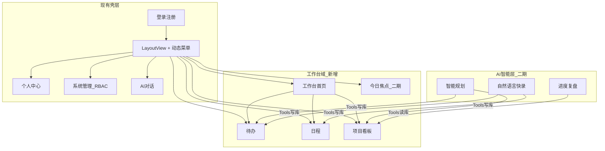
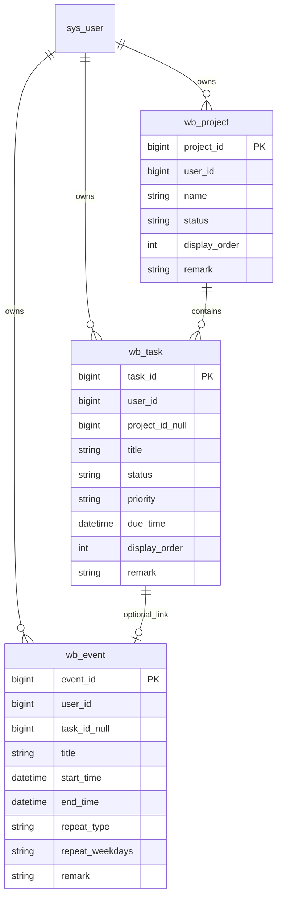
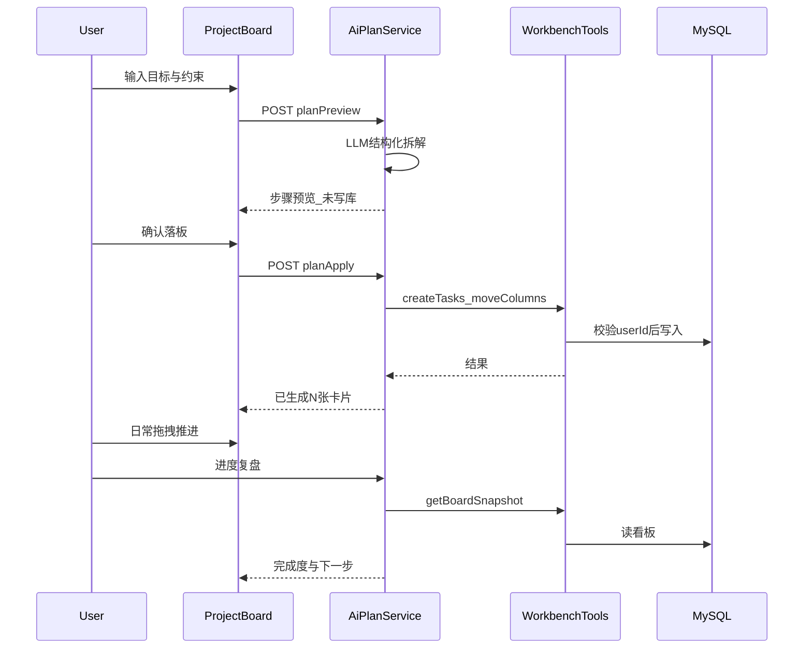

# 个人工作台设计方案

## 1. 产品定位

**一句话：** 基于现有系统底座，做「登录后就能推进今天工作」的个人工作台——待办跟手、日程可见、项目可拖。

| 维度               | 定义                                                         |
| ------------------ | ------------------------------------------------------------ |
| 用户               | 个人用户（`USER` 角色为主；管理员仍保留系统管理能力）        |
| 核心价值           | 把「今天要做的事」集中在一页，再分域深入处理                 |
| 非目标（一期不做） | 多人协作、分享链接、团队空间、复杂 Gantt、邮件同步           |
| 与现网关系         | 保留 Auth / RBAC / 个人中心 / AI 对话；工作台作为新业务域挂载，不改动权限引擎本身 |

**默认产品决策（已拍板）：**

- 数据按 `user_id` 隔离，接口强制校验归属，不做跨用户协作。
- **待办**与**项目任务**统一为同一种「任务」实体：可独立存在（今日待办），也可归属项目看板列。
- **日程**是独立实体，可可选关联任务（开会提醒 ≠ 任务本身）。
- **AI 升级为工作台智能层**：一期保留通用对话；二期以 Spring AI Tools 读写工作台实体，做成「规划 → 确认落板 → 跟踪进度」闭环（见第 9 节），不只做闲聊摘要。

------

## 2. 信息架构

### 导航结构（权限菜单）

在 `[sys_permission](sql/ChassisElevate-SQL.sql)` 中新增目录/菜单（建议权限 ID 段 `300+`），并授权给 `USER`(role_id=2) 与管理员：

- `工作台`（D）
  - `首页` → `/workbench`（聚合看板，替代「纯欢迎页」定位）
  - `待办` → `/workbench/todos`
  - `日程` → `/workbench/calendar`
  - `项目` → `/workbench/projects`
  - `项目看板` → `/workbench/projects/:id`（可不进侧栏，由项目列表进入）
  - `AI 规划`（二期菜单或项目内入口）→ 项目页「智能规划」按钮优先，侧栏可不单独占位

现有 `[DashboardPage.vue](vue-module/src/views/common/DashboardPage.vue)` 升级为工作台首页，或新增 `WorkbenchHomePage` 并将原 dashboard 路由指向它（推荐后者，避免破坏系统演示页语义时可保留 `/dashboard` 作轻入口重定向到 `/workbench`）。

------

## 3. 核心用户故事与 MVP

### 3.1 工作台首页

- 打开即可看到：今日待办、今日/近 3 日日程、进行中项目摘要。
- 支持「快速添加待办」（标题即可，默认今日）。
- 点击条目跳转到对应详情域。

### 3.2 待办

- CRUD；状态：未完成 / 已完成 / 取消（软删或归档）。
- 优先级：低 / 中 / 高；截止日；可选标签（一期可用简单 `tags` 字符串，二期再拆标签表）。
- 视图：今日 / 近期 / 全部 / 已完成。
- 可从待办「转成日程」（生成一条日程并写回关联）。

### 3.3 日程

- 日/周视图（一期做周视图 + 日详情侧栏即可）。
- 字段：标题、开始/结束时间、全天、地点（可选）、备注、关联任务（可选）。
- CRUD；按时间范围查询。

### 3.4 项目看板 / 任务

- 项目：名称、描述、状态（进行中/归档）、颜色/封面可选。
- 看板列：默认三列「待办 / 进行中 / 已完成」，支持重命名、排序、增删列。
- 卡片（任务）：标题、描述、优先级、截止日、所属列、排序；支持拖拽改列与同列排序。
- 项目级任务与「全局待办」共用任务表：`project_id` / `column_id` 为空 = 独立待办。

### 3.5 MVP 验收标准

1. 注册用户可登录后仅见自己的待办/日程/项目数据。
2. 首页三块数据来自真实 API，非静态文案。
3. 看板拖拽后刷新/重进状态保持。
4. `USER` 无系统管理菜单；工作台菜单齐全。
5. 关键接口带 `@SaCheckLogin`（或菜单权限码），服务层校验 `userId`。

------

## 4. 领域模型

**表设计要点（已落地 `[sql/workbench.sql](sql/workbench.sql)`）：**

- **三表**：`wb_project` / `wb_task` / `wb_event`；**无** `wb_board_column`。
- **无物理外键**；**物理删除**（无 `is_deleted`）。
- 排序字段统一 `display_order`；各表统一 `remark`。
- 任务：`project_id` 空 = 独立任务；非空 = 项目子任务。看板三列由 `status`（0待办/1进行中/2已完成）分组统计。
- 日程：`repeat_type=1` + `repeat_weekdays`（如 `1`=每周一）支持固定周会。
- 项目表不含颜色/封面；预留 `plan_batch_id` / `parent_task_id` 给 AI 规划。
- 权限菜单种子另补。

------

## 5. 技术落点（可开工）

### 5.1 后端：新建 `workbench-module`

对齐现有 Maven 多模块（`[springboot-module/pom.xml](springboot-module/pom.xml)`、`[ai-module](springboot-module/ai-module)` 模式）：

- 新建 `springboot-module/workbench-module`（依赖 `common-module`，被 `start-module` 引入）。
- 包结构建议：`com.moses.workbench.{controller,service,mapper,entity,dto}`。
- `RunApplication` 已扫描 `com.moses.**.mapper`，新模块按此规范即可被发现。

**一期 API（REST，统一 `ResultConfig` 信封）：**

| 域   | 方法          | 路径                             | 说明                             |
| ---- | ------------- | -------------------------------- | -------------------------------- |
| 首页 | GET           | `/workbench/home/summary`        | 今日待办 + 近几日日程 + 活跃项目 |
| 任务 | CRUD + 状态   | `/workbench/tasks`               | 全局待办与项目任务共用           |
| 任务 | PUT           | `/workbench/tasks/reorder`       | 批量改列/排序（看板拖拽）        |
| 日程 | CRUD + 范围查 | `/workbench/events`              | `from`/`to` 查询                 |
| 项目 | CRUD          | `/workbench/projects`            | 创建时自动建默认三列             |
| 看板 | GET           | `/workbench/projects/{id}/board` | 列 + 卡片聚合                    |
| 列   | CRUD/排序     | `/workbench/columns`             | 列管理                           |

**安全规则：** Controller 取 `StpUtil.getLoginIdAsLong()`；所有查询/更新 `WHERE user_id = ?`；禁止仅凭资源 id 越权。

### 5.2 前端：`views/workbench/`

沿用动态路由机制（`[pageComponents.js](vue-module/src/utils/pageComponents.js)` + `[dynamicRoutes.js](vue-module/src/router/dynamicRoutes.js)`）：

| 页面       | 建议路径                          | 组件                                                         |
| ---------- | --------------------------------- | ------------------------------------------------------------ |
| 工作台首页 | `workbench/WorkbenchHomePage.vue` | 三栏/三块聚合 + 快速添加                                     |
| 待办       | `workbench/TodoPage.vue`          | 列表过滤 + 完成勾选                                          |
| 日程       | `workbench/CalendarPage.vue`      | 周视图（可用 Ant Design Vue DatePicker/自定义格子；一期不强依赖重型日历库） |
| 项目列表   | `workbench/ProjectListPage.vue`   | 卡片列表进看板                                               |
| 看板       | `workbench/ProjectBoardPage.vue`  | 列拖拽（可引入轻量 sortable，如 SortableJS）                 |

API 封装放在 `vue-module/src/api/workbench/`，风格对齐现有 system/ai API。

### 5.3 权限种子（摘要）

- 目录：`workbench`（D）
- 菜单：`workbench:home` / `workbench:todo` / `workbench:calendar` / `workbench:project`
- 功能码（可选）：`workbench:task:add` 等，供按钮级控制
- 写入 `role_permission`：至少 `role_id=2`（USER）与管理员角色

------

## 6. 实践性功能清单（除基础 CRUD 外）

按「个人每天真会用到」筛选；标明分期，避免一期膨胀。

### 6.1 P0 — 一期跟着核心域一起做（轻量）

- **今日焦点条**：首页置顶「今天必须完成」数量 + 逾期红标（规则即可，无需 AI）。
- **快速捕获**：输入框一键新建待办（标题）；导航已有 Ctrl+K 暗示，可接到「快速建待办」。
- **看板进度百分比**：按列或按 `status=done` 自动计算，项目列表与首页可见。
- **逾期/临近截止**：待办与任务列表置顶或角标，首页汇总。

### 6.2 P1 — 二期主力（含 AI Tool 闭环）

- **AI 智能规划（项目）**：描述目标 → 拆里程碑/步骤 → 预览 → 一键落入看板列（详见第 9 节）。
- **AI 进度复盘**：读取当前看板状态，输出「完成度、阻塞项、下一步建议」（只读 Tool + 结构化回复）。
- **自然语言快录**：「明天下午 3 点开会准备材料」→ Tool 同时建日程 + 待办。
- **任务 ↔ 日程互转**：待办排进日历时间块；日程结束生成复查待办。
- **一句话拆任务**：单条过大待办 → AI 拆成子任务清单（确认后写入）。
- **今日计划包**：根据优先级 + 截止日，建议「今天做哪 3–5 件」（可先规则，再 AI）。

### 6.3 P2 — 三期深化（仍个人、不协作）

- **循环待办 / 重复日程**：每天/每周规则实例化。
- **项目模板**：如「写方案 / 学一门课 / 出差」一键生成默认列与种子任务。
- **周回顾**：本周完成数、逾期数、AI 简短复盘。
- **附件**（复用 OSS）：任务卡挂文件。
- **轻量番茄/专注计时**：与「今日焦点」联动（可选，非核心）。
- **站内提醒**：到期前角标 + 可选浏览器 Notification（不做邮件短信）。

### 6.4 明确不做（保持个人边界）

- 多人协作、评论@、共享看板、公开链接
- 企业级 OKR/复杂 Gantt/资源负载
- 自动同步外部 Google/Outlook（可列为更远期）

------

## 7. 分期路线图

### 一期（MVP）

- `workbench-module` + 核心表 + 权限种子
- 待办 / 日程 / 项目看板 + 拖拽
- 工作台首页聚合 + 今日焦点条 + 进度百分比 + 逾期标记
- 通用 AI 对话入口保留（现有 SSE）
- 个人数据隔离与 USER 菜单

### 二期（AI Tool 工作台智能层 — 差异化重点）

- Spring AI Tools 接 workbench 服务（读看板、建任务、改列、建日程）
- 项目「智能规划」确认流 + 「进度复盘」
- 自然语言快录、任务拆解、任务↔日程互转
- 任务搜索 / 简单标签 / 到期提醒

### 三期（个人深化）

- 循环规则、项目模板、周回顾、附件
- AI 会话与项目/任务实体弱关联（规划会话挂 `project_id`）
- 可选专注计时

------

## 8. 推荐一期开发切片（实施顺序）

1. **SQL + 权限种子**：建表、菜单、授权 USER。
2. **后端模块骨架**：entity/mapper/service + 任务/项目/日程基础 CRUD。
3. **看板聚合与 reorder**：保证拖拽持久化。
4. **首页 summary API**（含今日焦点、逾期数、项目进度）。
5. **前端页面与动态路由联调**：先待办与项目，再日程与首页。
6. **越权与空态验收**：换账号数据不可见；空项目提示创建。

二期切片起点：在 workbench Service 稳定后，于 `ai-module` 增加 Tool Bean + `/ai/plan`（或 `/workbench/ai/plan`）非流式/半流式规划接口，项目页挂「智能规划」入口。

------

## 9. AI 智能规划与 Tool 设计（已采纳方向）

现状：`[AiController](springboot-module/ai-module/src/main/java/com/moses/controller/AiController.java)` + `[AIChatService](springboot-module/ai-module)` 仅为 DeepSeek **SSE 闲聊** + Redis 记忆，**无 Tool / 无结构化落库**。Spring AI 1.1.x 支持 `.tools()` 与 `.entity()`，可作为扩展点。

### 9.1 产品闭环（用户感知）

**交互原则（必须）：**

1. **先预览、后写入** — LLM 不直接静默改库；用户点确认才 `planApply`。
2. **Tool 只调本用户 Service** — Tool 内强制 `StpUtil.getLoginIdAsLong()`，与 REST 同权。
3. **可撤销** — 一次规划产生的任务打同一 `plan_batch_id`，支持「撤销本次规划」。
4. **对话可继续** — 预览后用户可说「第 3 步再拆细一点」再二次预览。

### 9.2 Tool 清单（二期最小集）

| Tool                       | 作用                                                | 写库 |
| -------------------------- | --------------------------------------------------- | ---- |
| `getProjectBoard`          | 列 + 任务快照（复盘/增量规划）                      | 否   |
| `listTodayTasks`           | 今日待办与逾期                                      | 否   |
| `listEventsInRange`        | 日程空闲感知（避免排冲突，可先简版）                | 否   |
| `createProjectTasks`       | 批量建卡到指定列（或默认「待办」列）                | 是   |
| `updateTaskStatusOrColumn` | 推进/完成（复盘后「按建议执行」时用，默认仍需确认） | 是   |
| `createEvent`              | 为关键步骤写入时间块                                | 是   |
| `createInboxTask`          | 自然语言快录到全局待办                              | 是   |

### 9.3 API 形态（建议）

- `POST /workbench/ai/plan/preview` — body: `{ projectId, goal, constraints? }` → 结构化 `PlanPreviewDto`（里程碑、步骤、建议列、预估工期）。
- `POST /workbench/ai/plan/apply` — body: `{ projectId, planBatchId, steps[] }` → 写 `wb_task`，返回创建结果。
- `POST /workbench/ai/review` — body: `{ projectId }` → Tool 读板 + 文本/结构化复盘。
- `POST /workbench/ai/quick-capture` — 自然语言 → 待办/日程草案 → 确认写入。

实现上：规划可用 **非流式** `.call().entity(PlanPreviewDto.class)`；需要边想边看时再对流式拆一步。Tool 注册在独立 `WorkbenchAiTools` 组件，供 `ChatClient.prompt().tools(...)` 挂载，与现有 `/ai/chat` SSE 并存、互不影响。

### 9.4 模型字段补充（服务规划撤销）

在 `wb_task` 增加可选字段：

- `plan_batch_id`（varchar，可空）— 同一次 AI 落板批次
- `parent_task_id`（bigint，可空）— 支持「大步骤 → 子步骤」（二期启用，一期可空）

### 9.5 风险与约束

- DeepSeek Tool 调用需联调验证；若不稳定，降级为「纯 JSON 结构化输出 + 后端校验写入」，Tool 作二期增强。
- Token/费用：预览前限制目标字数；复盘只喂看板摘要而非全文历史。
- 安全：禁止通用「执行任意 SQL」类 Tool；白名单上述方法即可。

------

## 10. 成功指标（产品侧）

- 登录后 10 秒内能完成「添加一条今日待办」。
- 个人用户日常路径不必进入「系统管理」。
- 看板拖拽与待办完成是最高频操作，交互路径最短。
- 二期：从空项目到「AI 规划落板」在一分钟内完成；支持一批次撤销。
- 底座能力（登录、资料、AI 闲聊）零回退。